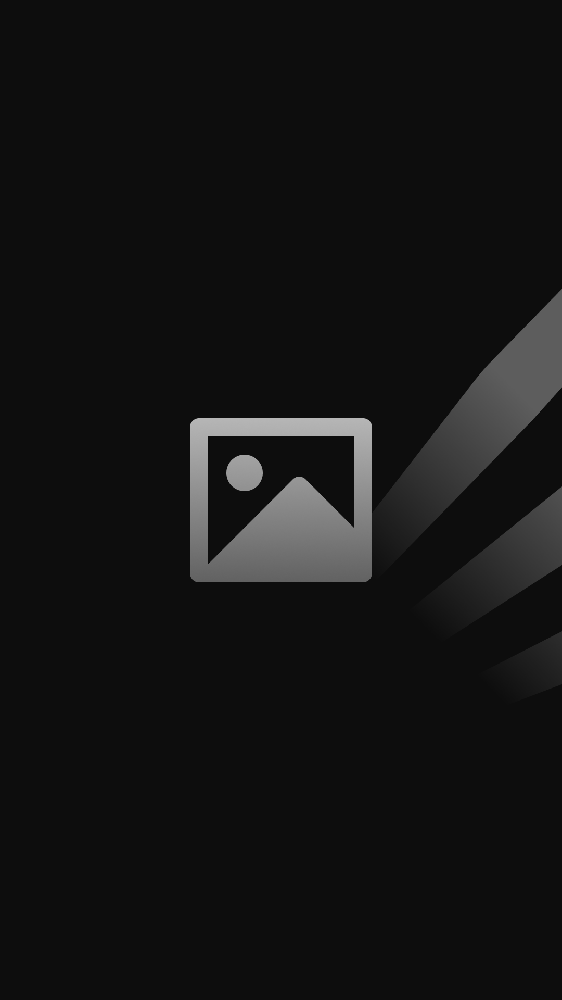

# {{applicationName}}
by {{author}}

A modern Vite-based React template for Phystack Grid Apps.

This is a full description. All content starting from here will be displayed at the information section on app page. Markdown syntax is supported: [link](http://google.com)

Description file is not always published with the app. To publish the description run `phystack app upload-description <app name>` or `yarn upload-description`.

## Features

- Fast development with Vite and HMR
- Type-safe settings management
- Hub client integration
- Analytics support
- Modern React 18

## Headers
- lists
- are
- also
- supported
